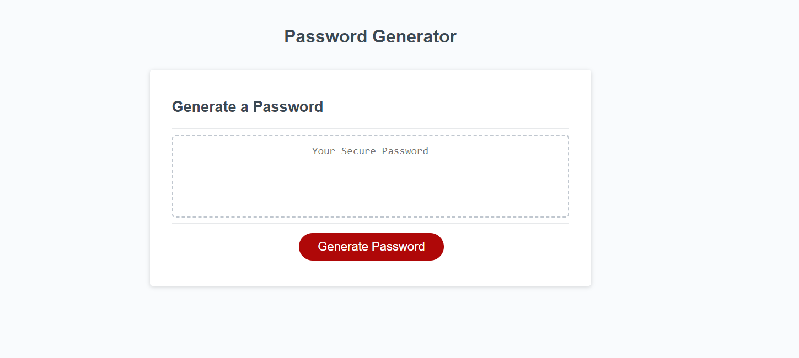
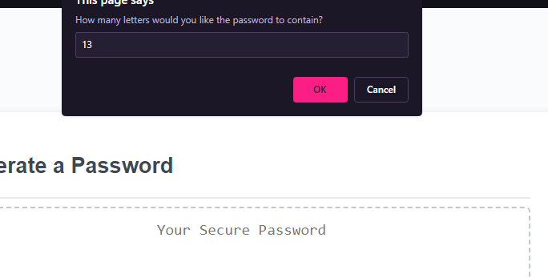
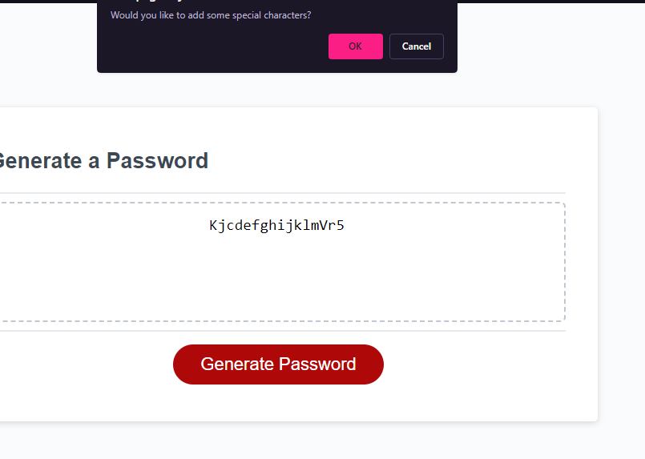
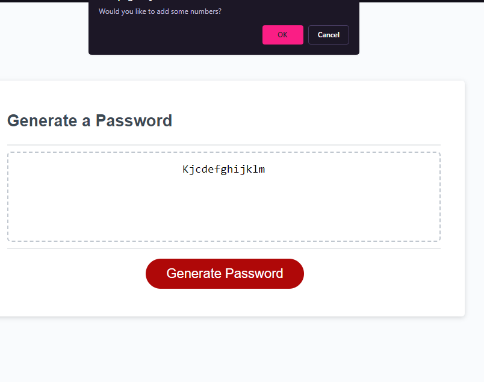
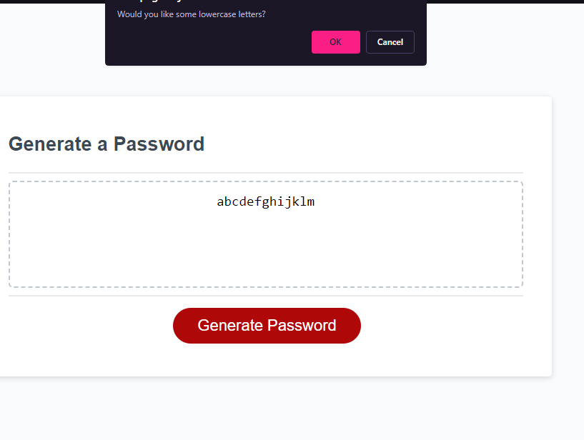
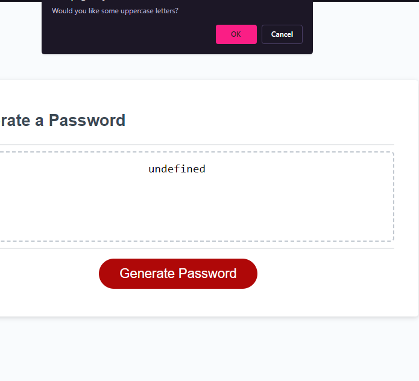

# Personal Password Creator

This is a random password generator build from HTML, CSS and JavaScript that allows its user to generate a completely new and randomized password between 8 and 128 characters from a set of parameters (uppercase or lowercase letters, special characters or numbers).

## Screenshots

## Links
* [Repo](https://github.com/Undrcver/Password-Generator)
* [Webpage]

## Languages Used
-CSS -JavaScript

## Luis Alicea 
